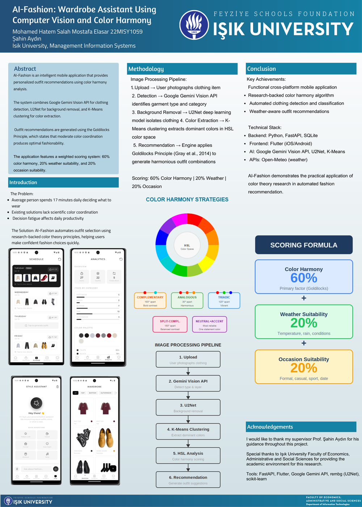

# AI Fashion Assistant

An AI-powered outfit recommendation app that analyzes your wardrobe and suggests combinations using computer vision and color harmony theory. Built as a cross-platform Flutter app backed by a FastAPI service.

> Graduation capstone — Management Information Systems, Işık University. Supervised by Prof. Şahin Aydın.



## Overview

The average person spends ~17 minutes a day deciding what to wear. AI-Fashion automates that using research-backed color theory. Users photograph clothing items, and the system detects the garment, removes the background, extracts dominant colors, and recommends harmonious outfits.

## How It Works

The image processing pipeline:

1. **Upload** — user photographs a clothing item
2. **Detection** — Google Gemini Vision API identifies garment type and category
3. **Background removal** — U2Net deep learning model isolates the clothing
4. **Color extraction** — K-Means clustering extracts dominant colors in HSL color space
5. **Recommendation** — the engine applies the Goldilocks Principle (Gray et al., 2014) to generate harmonious combinations

Outfits are scored with a weighted formula: **60% color harmony · 20% weather suitability · 20% occasion suitability**.

## Features

- Wardrobe management with automatic clothing detection and categorization
- Research-backed color harmony recommendations (complementary, analogous, triadic, etc.)
- Weather-aware suggestions via the Open-Meteo API
- Conversational style assistant
- Outfit scheduling and wardrobe usage analytics
- JWT-based user authentication

## Tech Stack

**Frontend (Flutter)**
- Dart, Flutter (iOS / Android / web / desktop)
- Provider for state management

**Backend (FastAPI)**
- Python, FastAPI, SQLite, SQLAlchemy
- Google Gemini Vision API — clothing detection
- U2Net (rembg) — background removal
- scikit-learn (K-Means) — color extraction
- Open-Meteo — weather data

Flutter app  ──►  FastAPI backend  ──►  Google Gemini Vision API

(lib/)            (ai-fashion-backend/)    U2Net · K-Means · Open-Meteo

├── routers/    # API endpoints

├── services/   # Gemini, color matching, recommendations

├── models/     # database models

└── schemas/    # request/response schemas

## Getting Started

### Backend

```bash
cd ai-fashion-backend
python -m venv venv
venv\Scripts\activate          # Windows  (use: source venv/bin/activate on macOS/Linux)
pip install -r requirements.txt
cp .env.example .env           # then fill in your Gemini API key and JWT secret
uvicorn main:app --reload
```

### Frontend

```bash
flutter pub get
flutter run
```

## Project Documentation

- 📄 [Full thesis](22MISY1059_Thesis_F.docx)
- 🖼 [Research poster](poster.png)

## Note

API keys and secrets are loaded from a git-ignored `.env` file. Use `.env.example` as a template — never commit real credentials.
- JWT authentication

## Architecture
